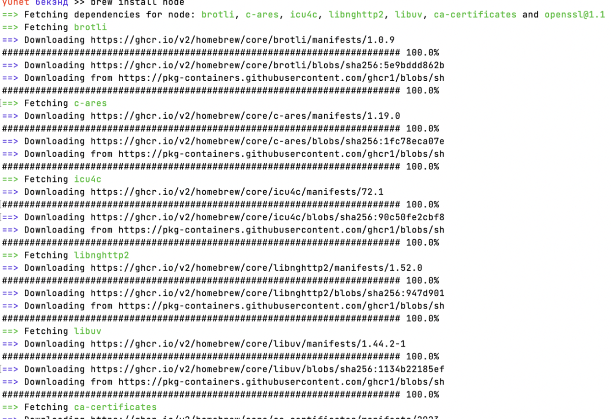
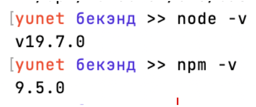
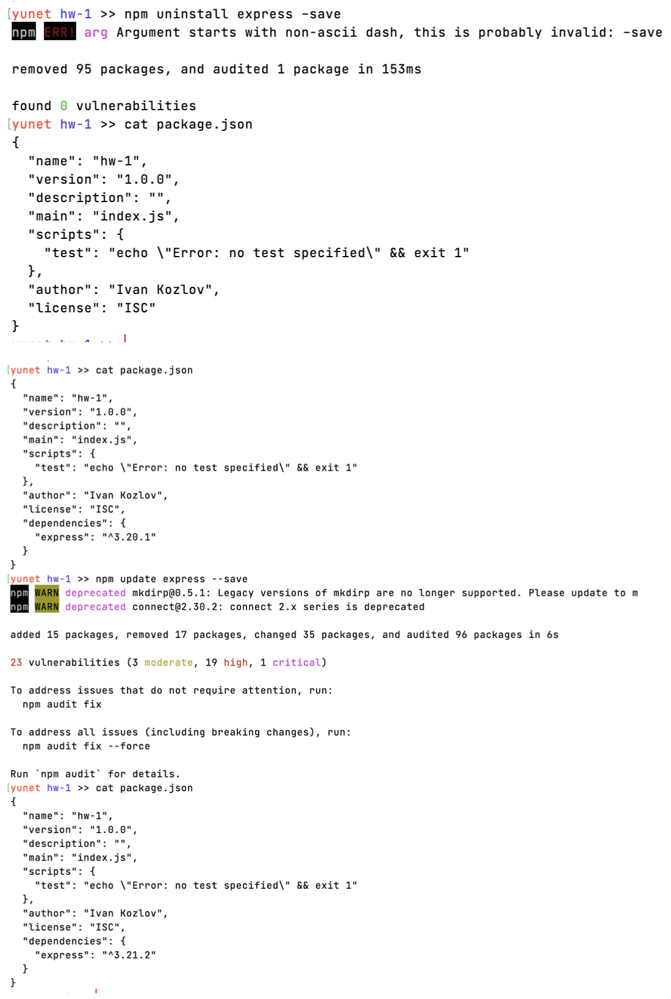

# Домашняя работа № 1

`Описание:` 

- У становка npm, node.js
- Инициализация npm-пакета
- У становка express
- У даление express/попытка его обновить
- Написание кастомной команды для npm, чтобы можно удалить express командой “npm run rme”

# Ход работы

- Установка node (на mac) через утилиту brew командой:
`brew install node`

- Теперь посмотрим текущие версии node и npm:

- Сделаем инициализацию проекта командой:
`npm init`

- Теперь установим express и сохраним его в списке зависимостей командой:`npm install express --save`

- Теперь удалим или обновим express из проекта командой:
`npm uninstall express --save` или
`npm update express --save`

- Пишем кастомную команду `npm run rme` для удаления express, для этого надо изменить файл package.json:

- Протестируем, предварительно установив express:

# Вывод 

В ходе работы я познакомился с командами npm.