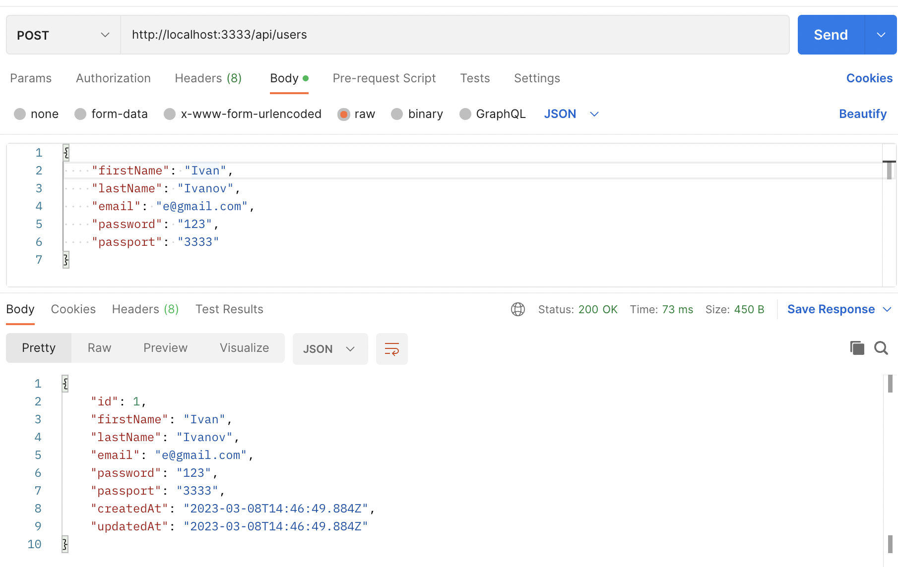
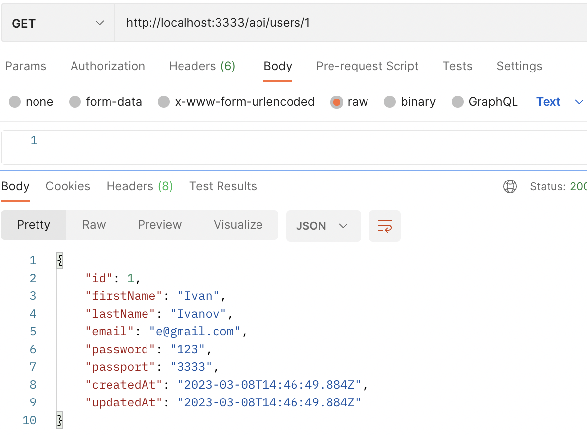
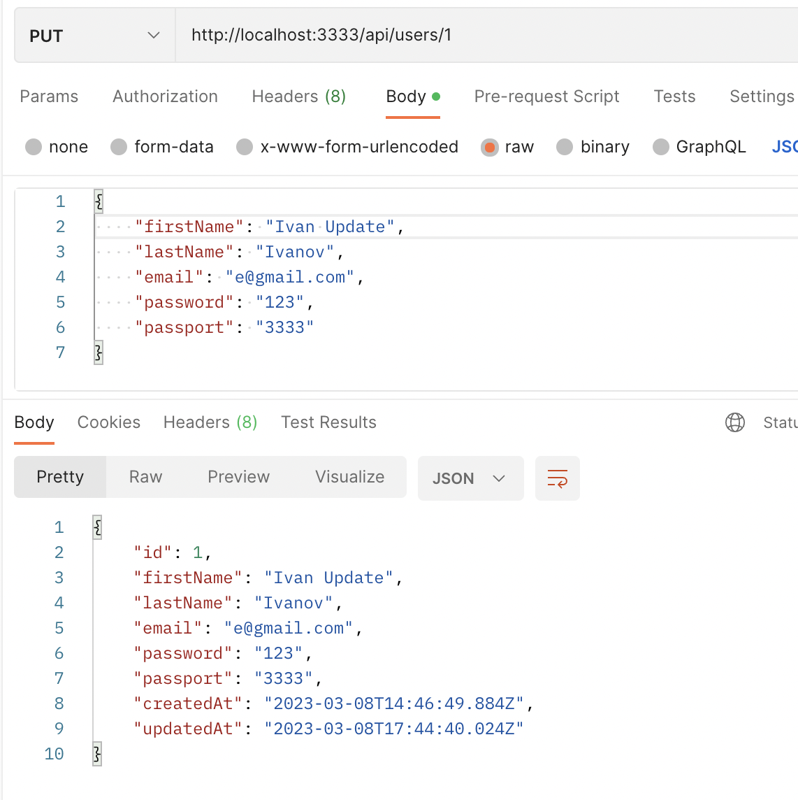
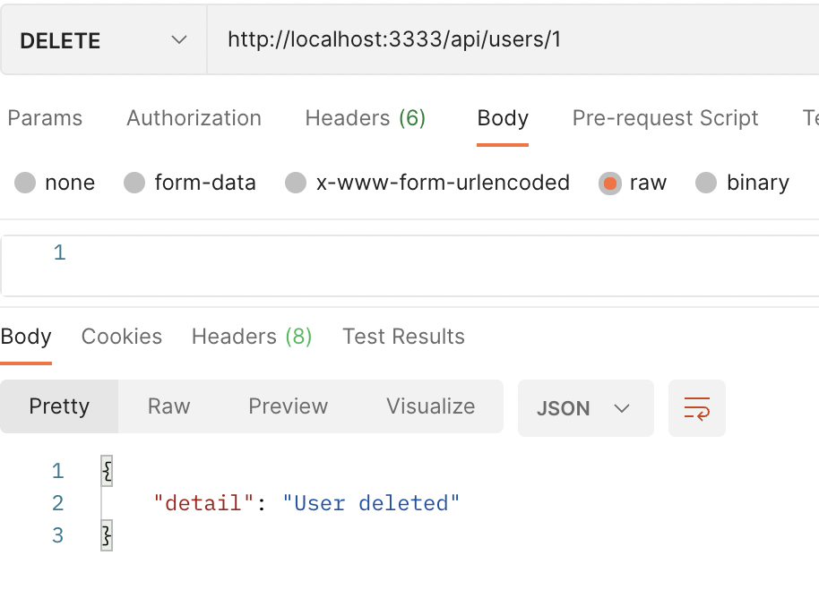

# Домашняя работа № 2
<h2>Знакомство с ORM Sequelize</h2>

`Описание:` 

- Продумать свою собственную модель пользователя
- Реализовать набор из CRUD-методов для работы с пользователями средствами Express + Sequelize
- Написать запрос для получения пользователя по id/email

`Материалы:`

[Презентация Express + Sequelize](https://docs.google.com/presentation/d/1QAyV4WYFkILzhd-f13J06z94X6vAmWrWlfM6RNvXiGo/edit?usp=sharing)

[Документация Express](http://expressjs.com/en/starter/hello-world.html)

[Документация Sequelize](https://sequelize.org/master/)

[Документация sequelize-cli](https://openbase.com/js/sequelize-cli/documentation)

[Пример, который делали на паре](https://github.com/kantegory/mentoring/tree/master/14_express_example)

<hr>

# Ход работы

Подготовим проект и пропишем в консоли команды:

- `npm init`
- `npm install express -S`
- `npm install sequelize -S`
- `npm install --save-dev sequelize-clix`
- `npm install nodemon`
- `npm install sqlite3 -S` 

С помщью sequelize-cli делаем модель пользователя и делаем миграции в консоли:
```
npx sequelize-cli model:generate --name User --attributes 
firstName:string,lastName:string,email:string,password:string,passport:string
```  
`npx sequelize-cli db:migrate`

Далее создадим файл index.js, который содержит основную логику.

- `index.js`

```javascript
const express = require('express')
const db = require('./models')
const bodyParser = require('body-parser')
const cors = require('cors')
const app = express()
const port = 3333

app.use(cors())
app.use(bodyParser.json())

app.get('/', (req, res) => {
    res.send('Hello World!')
})

app.get('/api/users/:id', async (req, res) => {
    const user = await db.User.findByPk(req.params.id)

    console.log('user is', user)

    if (user) {
        return res.send(user.toJSON())
    }

    return res.send({"msg": "user is not found"})
})

app.listen(port, () => {
    console.log(`Example app listening on port ${port}`)
})

app.post('/api/users/', async (req, res) => {
    try {
        const user = await db.User.create(req.body);
        await user.reload();
        res.send(user.toJSON());
    } catch (e) {
        return res.send({"msg": "failed to create"})
    }
})

app.put('/api/users/:id', async (req, res) => {
    const user = await db.User.findByPk(req.params.id);
    if (user) {
        try {
            user.update(req.body, {where: {id: req.params.id}});
            user.reload();
            res.send(user.toJSON());
        } catch (e) {
            return res.send({"msg": "failed to update"})
        }
    } else {
        return res.send({"msg": "user is not found"})
    }

})

app.delete('/api/users/:id', async (req, res) => {
    const user = await db.User.destroy({where: {id: req.params.id}})
    if (user) {
        res.send({"detail": "User deleted"});
    }
    return res.send({"msg": "user is not found"})
})
```

Также установлены зависимости, чтобы работать с JSON и CORS:

- `npm install body-parser -S` 
- `npm install cors -S` 

# Тестирование

- Создаем пользователя:



- Получаем пользователя по id:
  


- Обновляем данные пользователя по id:



- Удаляем пользователя по id:



<hr>

# Вывод
Я научился работать с моделями с помощью ORM Sequelize и создавать API с помощью Express