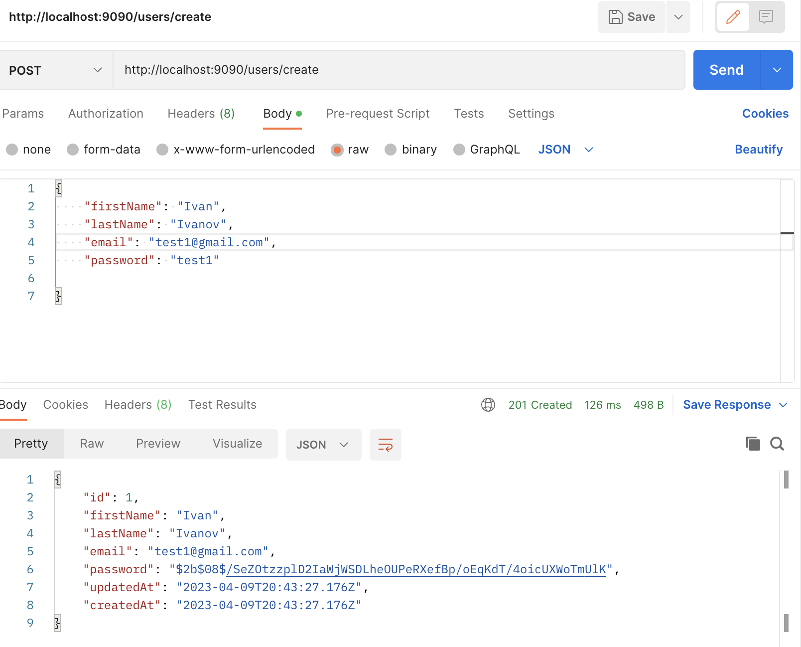
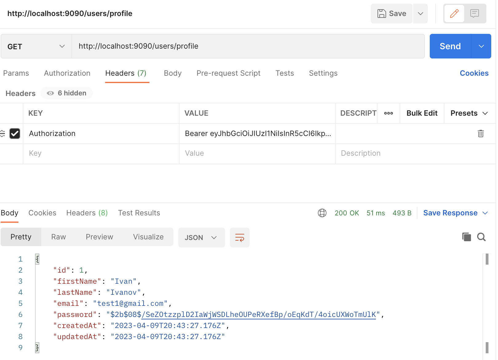
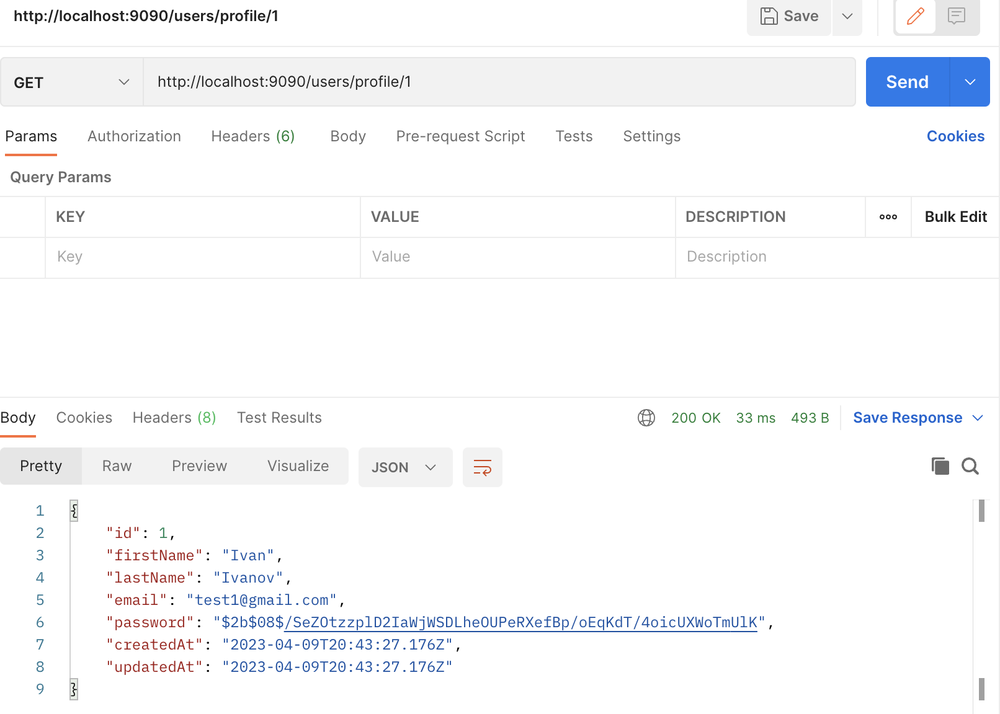

# Лабораторная работа № 1

`Описание:` 

Нужно написать свой boilerplate на express + sequelize / TypeORM + typescript.

Должно быть явное разделение на:

- модели
- контроллеры
- роуты
- сервисы для работы с моделями (реализуем паттерн “репозиторий”)
- [пример](https://github.com/kantegory/express-sequelize-boilerplate)

<hr>

# Структура boilerplate

`Скриншот структуры:`


<hr>

# Необходимые зависимости

В файле `package.json` были установлены необходимые зависимсоти:
```json
{
  "name": "lr_1",
  "version": "1.0.0",
  "description": "",
  "main": "index.js",
  "scripts": {
    "test": "echo \"Error: no test specified\" && exit 1"
  },
  "author": "",
  "license": "ISC",
  "dependencies": {
    "bcrypt": "^5.1.0",
    "body-parser": "^1.20.2",
    "cors": "^2.8.5",
    "express": "^4.18.2",
    "passport": "^0.6.0",
    "passport-jwt": "^4.0.1",
    "reflect-metadata": "^0.1.13",
    "sequelize": "^6.30.0",
    "sequelize-typescript": "^2.1.5",
    "sequelize-typescript-migration-v2": "^0.0.2-beta.6",
    "sqlite3": "^5.1.6",
    "tcs": "^10.0.2",
    "typeorm": "^0.3.13",
    "uuid": "^9.0.0"
  },
  "devDependencies": {
    "@types/bcrypt": "^5.0.0",
    "@types/cors": "^2.8.13",
    "@types/dotenv": "^8.2.0",
    "@types/express": "^4.17.17",
    "@types/express-session": "^1.17.7",
    "@types/flat": "^5.0.2",
    "@types/node": "^18.15.11",
    "@types/passport": "^1.0.12",
    "@types/passport-jwt": "^3.0.8",
    "@types/styled-components": "^5.1.26",
    "@types/styled-system": "^5.1.16",
    "@types/uuid": "^9.0.1",
    "@types/validator": "^13.7.14",
    "@typescript-eslint/eslint-plugin": "^5.57.1",
    "@typescript-eslint/parser": "^5.57.1",
    "dotenv": "^16.0.3",
    "eslint": "^8.38.0",
    "express-list-endpoints": "^6.0.0",
    "nodemon": "^2.0.22",
    "sequelize-cli": "^6.6.0",
    "ts-node": "^10.9.1",
    "typescript": "^5.0.4"
  }
}
```

<hr>

# Файлы окружения и конфигурации

`.env` - содержит переменные окружения

```env
#DATABASE
NAME=db
DIALECT=sqlite
USERNAME=root
PASSWORD=null
STORAGE=db.sqlite
DATABASE_DEVELOPMENT=database_development
DATABASE_TEST=database_test
DATABASE_PRODUCTION=database_production

# JWT
ACCESS_TOKEN_LIFETIME=3000000 # in milliseconds
REFRESH_TOKEN_LIFETIME=36000000 # in milliseconds

# SERVER
PORT=9090
HOST=127.0.0.1
```

`.eslintignore` - содержит дериктории, которые не нужно проверять линтером

```.eslintignore
node_modules
dist
```

`.eslintrc.js` - файл конфигурации для ESLint

```js
module.exports = {
    "env": {
        "browser": true,
        "es2021": true
    },
    "extends": [
        "eslint:recommended",
        "plugin:@typescript-eslint/recommended"
    ],
    "overrides": [
    ],
    "parser": "@typescript-eslint/parser",
    "parserOptions": {
        "ecmaVersion": "latest",
        "sourceType": "module"
    },
    "plugins": [
        "@typescript-eslint"
    ],
    "rules": {
    }
}
```

`.sequelizerc` - файл конфигурации для sequelize

```js
const path = require('path')

module.exports = {
  'config': path.resolve('src', 'configs/db.mjs'),
  'models-path': path.resolve('src', 'models'),
  'migrations-path': path.resolve('src', 'migrations'),
  'seeders-path': path.resolve('src', 'seeders')
}
```

`nodemon.json` -  это конфигурационный файл для пакета nodemon

```json
{
    "watch": [
        "src"
    ],
    "ext": "ts",
    "ignore": [
        "node_modules",
        "src/**/*.spec.ts"
    ],
    "exec": "ts-node ./src/index.ts"
}
```

`tsconfig.json` - это файл конфигурации TypeScript, который используется для настройки компилятора TypeScript

```json
{
  "compilerOptions": {
    "target": "es6",
    "module": "commonjs",
    "outDir": "./dist",
    "strict": true,
    "esModuleInterop": true,
    "strictPropertyInitialization": false,
    "experimentalDecorators": true,
    "emitDecoratorMetadata": true,
    "allowJs": true,
  },
  "include": [
    "./src/**/*"
  ],
  "exclude": [
    "node_modules"
  ]
}
```

<hr>

# Структура src

- `configs` - содержит файлы конфигурации, в данном случае файл для подключения к базе данных.

- `controllers` - содержит контроллеры для каждого ресурса, в данном случае контроллер для пользователей.

- `core` - содержит файлы ядра приложения, такие как файл, который инициализирует Express.

- `index.ts` - точка входа для запуска приложения.

- `middlewares` - содержит аутентификацию с использованием Passport.js.

- `migrations` - содержит файлы миграций для базы данных.

- `models` - содержит модели для каждой таблицы базы данных, в данном случае модели для пользователей и токенов.

- `providers` - содержит провайдеры, которые управляют зависимостями, в данном случае провайдер для создания и настройки подключения к базе данных.

- `routes` - содержит маршруты для каждого ресурса API, в данном случае маршруты для пользователей.

- `seeders` - содержит файлы начальных данных для базы данных.

- `services` - содержит службы, которые обрабатывают бизнес-логику приложения, в данном случае служба для пользователей и токенов обновления.

- `utils` - содержит утилиты, которые используются во всем приложении, в данном случае утилиты для проверки и хэширования паролей.

```bash
src/
├── configs
│   └── db.mjs
├── controllers
│   └── users
│       └── User.ts
├── core
│   └── index.ts
├── index.ts
├── middlewares
│   └── passport.ts
├── migrations
├── models
│   ├── auth
│   │   └── RefreshToken.ts
│   └── users
│       └── User.ts
├── providers
│   └── db.ts
├── routes
│   └── v1
│       ├── index.ts
│       └── users
│           └── User.ts
├── seeders
├── services
│   ├── auth
│   │   └── RefreshToken.ts
│   └── users
│       └── User.ts
└── utils
    ├── checkPassword.ts
    └── hashPassword.ts
```

<hr>

# Модели

`User.ts` - модель пользователя

```ts
import { AllowNull, BeforeCreate, BeforeUpdate, Column, Model, Table, Unique } from 'sequelize-typescript'
import hashPassword from '../../utils/hashPassword'

@Table
class User extends Model {
    @AllowNull(false)
    @Column
    firstName: string

    @AllowNull(false)
    @Column
    lastName: string

    @Unique
    @Column
    email: string

    @AllowNull(false)
    @Column
    password: string

    @BeforeCreate
    @BeforeUpdate
    static generatePasswordHash(instance: User) {
        const { password } = instance

        if (instance.changed('password')) {
            instance.password = hashPassword(password)
        }
    }
}

export default User
```

`RefreshToken.ts` - модель хранения токенов

```ts
import { Table, Column, Model, Unique, AllowNull, ForeignKey } from 'sequelize-typescript'
import User from '../users/User'

@Table
class RefreshToken extends Model {
    @Unique
    @AllowNull(false)
    @Column
    token: string

    @ForeignKey(() => User)
    @Column
    userId: number 
}

export default RefreshToken
```

<hr>

#  Маршруты (routes)

`src/routes/users/User.ts` - маршруты для пользователя

```ts
import express from "express"
import UserController from "../../../controllers/users/User"
import passport from "../../../middlewares/passport"

const router: express.Router = express.Router()

const controller: UserController = new UserController()

router.route('/').post(controller.post)

router.route('/h').get(controller.hello)

router.route('/profile').get(passport.authenticate('jwt', { session: false }), controller.me)

router.route('/profile/:id').get(controller.get)

router.route('/login').post(controller.auth)

router.route('/refresh').post(controller.refreshToken)

router.route('/create').post(controller.create)

export default router
```

`src/routes/index.ts` - export

```ts
import express from "express"
import userRoutes from "./users/User"

const router: express.Router = express.Router()

router.use('/users', userRoutes)

export default router
```
<hr>

# Контроллеры

Методы класса UserController:

- `get` : Получает идентификатор из параметров запроса, используя метод getById экземпляра UserService, и отправляет данные о пользователе в ответ.

- `post` : Получает тело запроса, создает пользователя с помощью метода create экземпляра UserService, и отправляет данные о созданном пользователе в ответ.

- `me` : Возвращает данные о пользователе, полученные из объекта запроса.

- `auth` : Получает адрес электронной почты и пароль из тела запроса, вызывает метод checkPassword экземпляра UserService для проверки соответствия пароля, генерирует новый токен доступа и токен обновления, и отправляет ответ с токенами и информацией о пользователе.

- `refreshToken` : Получает токен обновления из тела запроса, проверяет его с помощью метода isRefreshTokenExpired экземпляра RefreshTokenService, генерирует новый токен доступа и токен обновления, используя jsonwebtoken и экземпляр RefreshTokenService, и отправляет ответ с новыми токенами.

- `create` : Получает тело запроса, хеширует пароль пользователя, используя функцию hashPassword, создает пользователя с помощью метода create экземпляра UserService, и отправляет данные о созданном пользователе в ответ.

`src/controllers/users/User.ts` 

```ts
import jwt from 'jsonwebtoken'
import { jwtOptions } from '../../middlewares/passport'
import RefreshTokenService from '../../services/auth/RefreshToken'
import UserService from '../../services/users/User'
import hashPassword from '../../utils/hashPassword'

class UserController {
    private userService: UserService

    constructor() {
        this.userService = new UserService()
    }

    get = async (request: any, response: any) => {
        try {
            const user = await this.userService.getById(
                Number(request.params.id)
            )

            response.send(user)
        } catch (error: any) {
            response.status(404).send({ "error": error.message })
        }
    }

    post = async (request: any, response: any) => {
        const { body } = request

        try {
            const user = await this.userService.create(body)

            response.status(201).send(user)
        } catch (error: any) {
            response.status(400).send({ "error": error.message })
        }
    }

    me = async (request: any, response: any) => {
        response.send(request.user)
    }

    hello = async (request: any, response: any) => {
        const html = '<html><body><h1>Hello World!</h1></body></html>';
        response.send(html)
    }

    auth = async (request: any, response: any) => {
        const { body } = request

        const { email, password } = body

        try {
            const { user, checkPassword } = await this.userService.checkPassword(email, password)
            if (checkPassword) {
                const payload = { id: user.id }

                console.log('payload is', payload)

                const accessToken = jwt.sign(payload, jwtOptions.secretOrKey)

                const refreshTokenService = new RefreshTokenService(user)

                const refreshToken = await refreshTokenService.generateRefreshToken()

                response.send({ 'Answer' : `You successfully logged in as ${user.firstName} ${user.lastName}`, 
                accessToken, refreshToken })
            } else {
                throw new Error('Login or password is incorrect!')
            }
        } catch (e: any) {
            response.status(401).send({ "error": e.message })
        }
    }

    refreshToken = async (request: any, response: any) => {
        const { body } = request

        const { refreshToken } = body

        const refreshTokenService = new RefreshTokenService()

        try {
            const { userId, isExpired } = await refreshTokenService
                .isRefreshTokenExpired(refreshToken)

            if (!isExpired && userId) {
                const user = await this.userService.getById(userId)

                const payload = { id: user.id }

                const accessToken = jwt.sign(payload, jwtOptions.secretOrKey)

                const refreshTokenService = new RefreshTokenService(user)

                const refreshToken = await refreshTokenService.generateRefreshToken()

                response.send({ accessToken, refreshToken })
            } else {
                throw new Error('Invalid credentials')
            }
        } catch (e) {
            response.status(401).send({ 'error': 'Invalid credentials' })
        }
    }

    create = async (request: any, response: any) => {
        try {
            const { body } = request
            body.password = hashPassword(body.password)

            const user = await this.userService.create(body)

            response.status(201).send(user)
        } catch (error: any) {
            response.status(400).send({ "error": error.message })
        }
    }
}

export default UserController
```

<hr>

# Cервисы для работы с моделями

- `src/services/users/User.ts`

```ts
import User from '../../models/users/User'
import sequelize from '../../providers/db'
import checkPassword from '../../utils/checkPassword'
const userRepository = sequelize.getRepository(User)

class UserService {

    async getById(id: number): Promise<User> {
        const user = await userRepository.findOne({ where: { 'id': id } })
        if (user) return user
        throw new Error(`User with id ${id} not found`)
    }

    async create(userData: Partial<User>): Promise<User> {
        try {
            const user = await userRepository.create(userData)
            return user.toJSON()
        }
        catch (e: any) {
            const errors = e.errors.map((error: any) => error.message)
            throw console.log(errors)
        }
    }

    async checkPassword(email: string, password: string): Promise<any> {
        const user = await userRepository.findOne({ where: { 'email' : email } })

        if (user) return { user: user.toJSON(), checkPassword: checkPassword(user.dataValues, password) }

        throw console.log('Incorrect login/password!')
    }
}

export default UserService

```

- `src/services/auth/RefreshToken.ts`

```ts
import { randomUUID } from "crypto"
import dotenv from "dotenv"
import RefreshToken from '../../models/auth/RefreshToken'
import User from '../../models/users/User'
dotenv.config()

class RefreshTokenService {
    private user: User | null

    constructor(user: User | null = null) {
        this.user = user
    }

    generateRefreshToken = async (): Promise<string> => {
        const token = randomUUID()

        const userId = this.user?.id

        await RefreshToken.create({ token, userId })

        return token
    }

    isRefreshTokenExpired = async (token: string): Promise<{ userId: number | null, isExpired: boolean }> => {
        const refreshToken = await RefreshToken.findOne({ where: { token } })

        if (refreshToken) {
            const tokenData = refreshToken.toJSON()

            const currentDate = new Date()
            const timeDelta = currentDate.getTime() - tokenData.createdAt.getTime()

            if (timeDelta > 0 && timeDelta < parseInt(process.env.REFRESH_TOKEN_LIFETIME!)) {
                return { userId: tokenData.userId, isExpired: false }
            }

            return { userId: null, isExpired: true }
        }

        return { userId: null, isExpired: true }
    }
}

export default RefreshTokenService
```

<hr>

# Пример работы

- Создание пользователя



- Вход пользователя


- Получение пользователя, если он вошел



- Получение пользователя по id



<hr>

# Вывод

В ходе работы были созданы основные файлы и структура проекта согласно требованиям. Такой boilerplate позволит быстро начать работу над проектом, используя готовые решения и подходы.
Разделение на модели, контроллеры, роуты и сервисы позволяет улучшить читаемость и поддерживаемость кода, а также обеспечивает возможность изменения отдельных компонентов приложения без влияния на другие.
Также я познакомился как работать с sequelize/TypeORM, typescript и express.