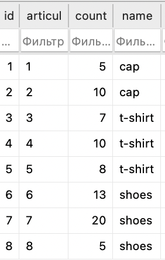
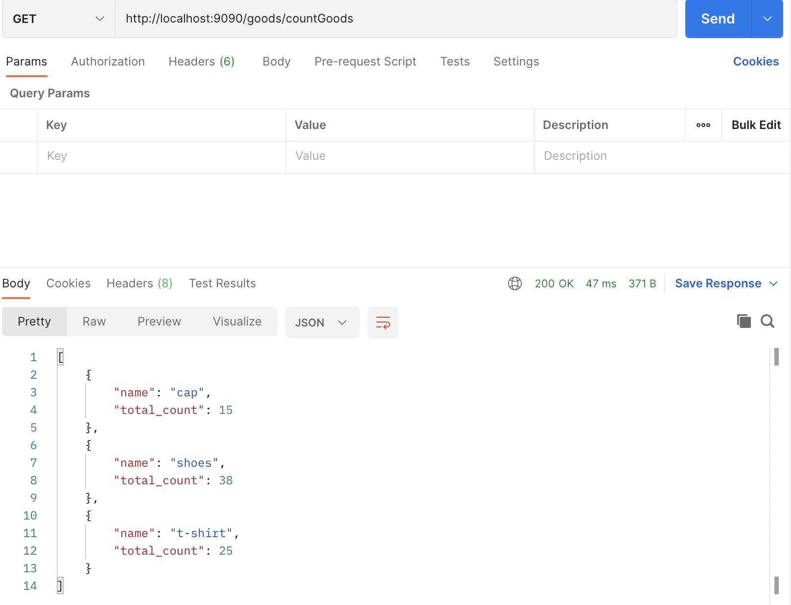

# Лабораторная работа № 2

`Описание:`

В рамках данной лабораторной работы Вам предложено выбрать один из нескольких вариантов. Выбранный вариант останется единым на весь курс и будет использоваться в последующих лабораторных работах.

По выбранному варианту необходимо будет реализовать RESTful API средствами express + typescript (используя ранее написанный boilerplate).

`Вариант 4:`
Сайт администратора интернет-магазина

- Вход

- Регистрация

- Учёт товара на складе

- Графики по продажам тех или иных товаров

- Управление сотрудниками

<hr>

# Структура src

- `configs` - содержит файлы конфигурации, в данном случае файл для подключения к базе данных.

- `controllers` - содержит контроллеры для каждого ресурса, в данном случае контроллер для пользователей.

- `core` - содержит файлы ядра приложения, такие как файл, который инициализирует Express.

- `index.ts` - точка входа для запуска приложения.

- `middlewares` - содержит аутентификацию с использованием Passport.js.

- `migrations` - содержит файлы миграций для базы данных.

- `models` - содержит модели для каждой таблицы базы данных, в данном случае модели для пользователей, токенов, работников, товаров.

- `providers` - содержит провайдеры, которые управляют зависимостями, в данном случае провайдер для создания и настройки подключения к базе данных.

- `routes` - содержит маршруты для каждого ресурса API, в данном случае маршруты для пользователей.

- `seeders` - содержит файлы начальных данных для базы данных.

- `services` - содержит службы, которые обрабатывают бизнес-логику приложения, в данном случае служба для пользователей, токенов обновления, работников, товаров.

- `utils` - содержит утилиты, которые используются во всем приложении, в данном случае утилиты для проверки и хэширования паролей.

```bash
.
├── configs
│   └── db.mjs
├── controllers
│   ├── goods
│   │   └── Goods.ts
│   ├── users
│   │   └── User.ts
│   └── workers
│       └── Workers.ts
├── core
│   └── index.ts
├── index.ts
├── middlewares
│   └── passport.ts
├── migrations
├── models
│   ├── auth
│   │   └── RefreshToken.ts
│   ├── goods
│   │   └── Goods.ts
│   ├── users
│   │   └── User.ts
│   └── workers
│       └── Workers.ts
├── providers
│   └── db.ts
├── routes
│   └── v1
│       ├── goods
│       │   └── Goods.ts
│       ├── index.ts
│       ├── users
│       │   └── User.ts
│       └── workers
│           └── Workers.ts
├── seeders
├── services
│   ├── auth
│   │   └── RefreshToken.ts
│   ├── goods
│   │   └── Goods.ts
│   ├── users
│   │   └── User.ts
│   └── workers
│       └── Workers.ts
└── utils
    ├── checkPassword.ts
    └── hashPassword.ts

```

<hr>

# Модели

`User.ts` - модель пользователя

```ts
import { AllowNull, BeforeCreate, BeforeUpdate, Column, Model, Table, Unique } from 'sequelize-typescript'
import hashPassword from '../../utils/hashPassword'

@Table
class User extends Model {
    @AllowNull(false)
    @Column
    firstName: string

    @AllowNull(false)
    @Column
    lastName: string

    @Unique
    @Column
    email: string

    @AllowNull(false)
    @Column
    password: string

    @BeforeCreate
    @BeforeUpdate
    static generatePasswordHash(instance: User) {
        const { password } = instance

        if (instance.changed('password')) {
            instance.password = hashPassword(password)
        }
    }
}

export default User
```

`RefreshToken.ts` - модель хранения токенов

```ts
import { Table, Column, Model, Unique, AllowNull, ForeignKey } from 'sequelize-typescript'
import User from '../users/User'

@Table
class RefreshToken extends Model {
    @Unique
    @AllowNull(false)
    @Column
    token: string

    @ForeignKey(() => User)
    @Column
    userId: number 
}

export default RefreshToken
```

`Workers.ts` - модель работников

```ts
import { AllowNull, Column, Model, Table, Unique } from 'sequelize-typescript';

@Table
class Worker extends Model {
  @AllowNull(false)
  @Unique
  @Column
  passport: string;

  @AllowNull(false)
  @Column
  name: string;

  @AllowNull(false)
  @Column
  position: string;

  @AllowNull(false)
  @Column
  salary: number;
}

export default Worker;

```

`Goods.ts` - модель товаров

```ts
import { AllowNull, Column, Model, Table, Unique } from 'sequelize-typescript'

@Table
class Goods extends Model {
    @AllowNull(false)
    @Unique
    @Column
    articul: string

    @AllowNull(false)
    @Column
    count: number

    @AllowNull(false)
    @Column
    name: string
}

export default Goods

```

<hr>

# Cервисы для работы с моделями

- `src/services/users/User.ts`

```ts
import User from '../../models/users/User'
import sequelize from '../../providers/db'
import checkPassword from '../../utils/checkPassword'
const userRepository = sequelize.getRepository(User)

class UserService {

    async getById(id: number): Promise<User> {
        const user = await userRepository.findOne({ where: { 'id': id } })
        if (user) return user
        throw new Error(`User with id ${id} not found`)
    }

    async create(userData: Partial<User>): Promise<User> {
        try {
            const user = await userRepository.create(userData)
            return user.toJSON()
        }
        catch (e: any) {
            const errors = e.errors.map((error: any) => error.message)
            throw console.log(errors)
        }
    }

    async checkPassword(email: string, password: string): Promise<any> {
        const user = await userRepository.findOne({ where: { 'email' : email } })

        if (user) return { user: user.toJSON(), checkPassword: checkPassword(user.dataValues, password) }

        throw console.log('Incorrect login/password!')
    }
}

export default UserService

```

- `src/services/auth/RefreshToken.ts`

```ts
import { randomUUID } from "crypto"
import dotenv from "dotenv"
import RefreshToken from '../../models/auth/RefreshToken'
import User from '../../models/users/User'
dotenv.config()

class RefreshTokenService {
    private user: User | null

    constructor(user: User | null = null) {
        this.user = user
    }

    generateRefreshToken = async (): Promise<string> => {
        const token = randomUUID()

        const userId = this.user?.id

        await RefreshToken.create({ token, userId })

        return token
    }

    isRefreshTokenExpired = async (token: string): Promise<{ userId: number | null, isExpired: boolean }> => {
        const refreshToken = await RefreshToken.findOne({ where: { token } })

        if (refreshToken) {
            const tokenData = refreshToken.toJSON()

            const currentDate = new Date()
            const timeDelta = currentDate.getTime() - tokenData.createdAt.getTime()

            if (timeDelta > 0 && timeDelta < parseInt(process.env.REFRESH_TOKEN_LIFETIME!)) {
                return { userId: tokenData.userId, isExpired: false }
            }

            return { userId: null, isExpired: true }
        }

        return { userId: null, isExpired: true }
    }
}

export default RefreshTokenService
```

- `src/services/goods/Goods.ts`

```ts
import Goods from '../../models/goods/Goods'
import sequelize from '../../providers/db'

const goodsRepository = sequelize.getRepository(Goods)

class GoodsService {
    async getById(id: number): Promise<Goods> {
        const goods = await goodsRepository.findOne({ where: { 'articul': id } })
        if (goods) return goods
        throw new Error(`Goods with id ${id} not found`)
    }

    async create(goodsData: Partial<Goods>): Promise<Goods> {
        try {
            const goods = await goodsRepository.create(goodsData)
            return goods.toJSON()
        }
        catch (e: any) {
            const errors = e.errors.map((error: any) => error.message)
            throw console.log(errors)
        }
    }

    async update(id: number, goodsData: Partial<Goods>): Promise<Goods> {
        try {
            const goods = await goodsRepository.findOne({ where: { 'articul': id } })

            if (goods) {
                await goods.update(goodsData)
                return goods.toJSON()
            }
            throw new Error(`Goods with id ${id} not found`)
        }
        catch (e: any) {
            const errors = e.errors.map((error: any) => error.message)
            throw console.log(errors)
        }
    }

    async delete(id: number): Promise<void> {
        const goods = await goodsRepository.findOne({ where: { 'articul': id } })
        if (goods) {
            await goods.destroy()
            return
        }
        throw new Error(`Goods with id ${id} not found`)
    }

    async getCountGoods(): Promise<any> {
        const result = await goodsRepository.findAll({
            attributes: ['name', [sequelize.fn('SUM', sequelize.col('count')), 'total_count']],
            group: ['name']
        });
        return result;
    }
}

export default GoodsService    
```

- `src/services/workers/Workers.ts`

```ts
import Worker from '../../models/workers/Workers';
import sequelize from '../../providers/db';

const workersRepository = sequelize.getRepository(Worker);

class WorkersService {
    async get(id: number): Promise<Worker> {
        const worker = await workersRepository.findOne({ where: { 'id': id } });
        if (worker) return worker
        throw new Error(`Worker with id ${id} not found`);
    }

    async create(workerData: Partial<Worker>): Promise<Worker> {
        try {
            const worker = await workersRepository.create(workerData);
            return worker.toJSON();
        } catch (e: any) {
            const errors = e.errors.map((error: any) => error.message);
            throw console.log(errors);
        }
    }

    async update(id: number, workerData: Partial<Worker>): Promise<Worker> {
        try {
            const worker = await workersRepository.findOne({ where: { id } });

            if (worker) {
                await worker.update(workerData);
                return worker.toJSON();
            }
            throw new Error(`Worker with id ${id} not found`);
        } catch (e: any) {
            const errors = e.errors.map((error: any) => error.message);
            throw console.log(errors);
        }
    }

    async delete(id: number): Promise<void> {
        const worker = await workersRepository.findOne({ where: { id } });
        if (worker) {
            await worker.destroy();
            return;
        }
        throw new Error(`Worker with id ${id} not found`);
    }

}

export default WorkersService;

```

<hr>

# Контроллеры

`UserController`

```ts
import jwt from 'jsonwebtoken'
import { jwtOptions } from '../../middlewares/passport'
import RefreshTokenService from '../../services/auth/RefreshToken'
import UserService from '../../services/users/User'
import hashPassword from '../../utils/hashPassword'

class UserController {
    private userService: UserService

    constructor() {
        this.userService = new UserService()
    }

    get = async (request: any, response: any) => {
        try {
            const user = await this.userService.getById(
                Number(request.params.id)
            )

            response.send(user)
        } catch (error: any) {
            response.status(404).send({ "error": error.message })
        }
    }

    post = async (request: any, response: any) => {
        const { body } = request

        try {
            const user = await this.userService.create(body)

            response.status(201).send(user)
        } catch (error: any) {
            response.status(400).send({ "error": error.message })
        }
    }

    me = async (request: any, response: any) => {
        response.send(request.user)
    }

    hello = async (request: any, response: any) => {
        const html = '<html><body><h1>Hello World!</h1></body></html>';
        response.send(html)
    }

    auth = async (request: any, response: any) => {
        const { body } = request

        const { email, password } = body

        try {
            const { user, checkPassword } = await this.userService.checkPassword(email, password)
            if (checkPassword) {
                const payload = { id: user.id }

                console.log('payload is', payload)

                const accessToken = jwt.sign(payload, jwtOptions.secretOrKey)

                const refreshTokenService = new RefreshTokenService(user)

                const refreshToken = await refreshTokenService.generateRefreshToken()

                response.send({ 'Answer' : `You successfully logged in as ${user.firstName} ${user.lastName}`, 
                accessToken, refreshToken })
            } else {
                throw new Error('Login or password is incorrect!')
            }
        } catch (e: any) {
            response.status(401).send({ "error": e.message })
        }
    }

    refreshToken = async (request: any, response: any) => {
        const { body } = request

        const { refreshToken } = body

        const refreshTokenService = new RefreshTokenService()

        try {
            const { userId, isExpired } = await refreshTokenService
                .isRefreshTokenExpired(refreshToken)

            if (!isExpired && userId) {
                const user = await this.userService.getById(userId)

                const payload = { id: user.id }

                const accessToken = jwt.sign(payload, jwtOptions.secretOrKey)

                const refreshTokenService = new RefreshTokenService(user)

                const refreshToken = await refreshTokenService.generateRefreshToken()

                response.send({ accessToken, refreshToken })
            } else {
                throw new Error('Invalid credentials')
            }
        } catch (e) {
            response.status(401).send({ 'error': 'Invalid credentials' })
        }
    }

    create = async (request: any, response: any) => {
        try {
            const { body } = request
            body.password = hashPassword(body.password)

            const user = await this.userService.create(body)

            response.status(201).send(user)
        } catch (error: any) {
            response.status(400).send({ "error": error.message })
        }
    }
}

export default UserController
```

`GoodsController`

```ts
import GoodsService from '../../services/goods/Goods'
import RefreshTokenService from '../../services/auth/RefreshToken'

class GoodsController {
    private goodsService: GoodsService

    constructor() {
        this.goodsService = new GoodsService()
    }

    get = async (request: any, response: any) => {
        try {
            const goods = await this.goodsService.getById(
                Number(request.params.id)
            )

            response.send(goods)
        } catch (error: any) {
            response.status(404).send({ "error": "error" })
        }
    }

    create = async (request: any, response: any) => {
        const { body } = request

        try {
            const goods = await this.goodsService.create(body)

            response.status(200).send(goods)
        } catch (error: any) {
            response.status(400).send({ "error": "error" })
        }
    }

    update = async (request: any, response: any) => {
        const refreshToken = request.headers["refreshtoken"];
        if (!refreshToken) {
            response.status(400).send({ "error": "Missing refreshToken header" });
            return;
        }
        const refreshTokenService = new RefreshTokenService();
        const { userId, isExpired } = await refreshTokenService.isRefreshTokenExpired(refreshToken);
        if(isExpired){
            response.status(401).send({ "error": "Unauthorized, u need new refreshToken" });
            return;
        }

        const { body } = request

        const id = Number(request.params.id)

        try {
            const goods = await this.goodsService.update(id, body)

            response.send(goods)
        } catch (error: any) {
            response.status(400).send({ "error": "error" })
        }
    }

    delete = async (request: any, response: any) => {
        const refreshToken = request.headers["refreshtoken"];
        if (!refreshToken) {
            response.status(400).send({ "error": "Missing refreshToken header" });
            return;
        }
        const refreshTokenService = new RefreshTokenService();
        const { userId, isExpired } = await refreshTokenService.isRefreshTokenExpired(refreshToken);
        if(isExpired){
            response.status(401).send({ "error": "Unauthorized, u need new refreshToken" });
            return;
        }

        const id = Number(request.params.id)

        try {
            await this.goodsService.delete(id)

            response.status(200).send({ message: `Goods with id ${id} has been deleted` })
        } catch (error: any) {
            response.status(400).send({ "error": "error" })
        }
    }

    getCountGoods = async (request: any, response: any) => {
        try {
            const goods = await this.goodsService.getCountGoods()
            response.send(goods)
        } catch (error: any) {
            response.status(404).send({ "error": "error" })
        }
    }
}

export default GoodsController

```

`WorkersController`

```ts
import RefreshTokenService from '../../services/auth/RefreshToken';
import WorkersService from '../../services/workers/Workers';

class WorkersController {
    private workersService: WorkersService;

    constructor() {
        this.workersService = new WorkersService();
    }

    get = async (request: any, response: any) => {
        try {
            const worker = await this.workersService.get(
                Number(request.params.id)
            );

            response.send(worker);
        } catch (error: any) {
            response.status(404).send({ "error": "error" });
        }
    };

    create = async (request: any, response: any) => {
        const { body } = request;

        try {
            const worker = await this.workersService.create(body);

            response.status(200).send(worker);
        } catch (error: any) {
            response.status(400).send({ "error": "error" });
        }
    };

    update = async (request: any, response: any) => {
        const refreshToken = request.headers["refreshtoken"];
        if (!refreshToken) {
            response.status(400).send({ "error": "Missing refreshToken header" });
            return;
        }
        const refreshTokenService = new RefreshTokenService();
        const { userId, isExpired } = await refreshTokenService.isRefreshTokenExpired(refreshToken);
        if (isExpired) {
            response.status(401).send({ "error": "Unauthorized, u need new refreshToken" });
            return;
        }

        const { body } = request;

        const id = Number(request.params.id);

        try {
            const worker = await this.workersService.update(id, body);

            response.send(worker);
        } catch (error: any) {
            response.status(400).send({ "error": "error" });
        }
    };

    delete = async (request: any, response: any) => {
        const refreshToken = request.headers["refreshtoken"];
        if (!refreshToken) {
            response.status(400).send({ "error": "Missing refreshToken header" });
            return;
        }
        const refreshTokenService = new RefreshTokenService();
        const { userId, isExpired } = await refreshTokenService.isRefreshTokenExpired(refreshToken);
        if (isExpired) {
            response.status(401).send({ "error": "Unauthorized, u need new refreshToken" });
            return;
        }

        const id = Number(request.params.id);

        try {
            await this.workersService.delete(id);

            response.status(200).send({ message: `Worker with id ${id} has been deleted` });
        } catch (error: any) {
            response.status(400).send({ "error": "error" });

        }
    }
}

export default WorkersController;
```
<hr>

#  Маршруты (routes)

`src/routes/users/User.ts` - маршруты для пользователя

```ts
import express from "express"
import UserController from "../../../controllers/users/User"
import passport from "../../../middlewares/passport"

const router: express.Router = express.Router()

const controller: UserController = new UserController()

router.route('/').post(controller.post)

router.route('/h').get(controller.hello)

router.route('/profile').get(passport.authenticate('jwt', { session: false }), controller.me)

router.route('/profile/:id').get(controller.get)

router.route('/login').post(controller.auth)

router.route('/refresh').post(controller.refreshToken)

router.route('/create').post(controller.create)

export default router
```

`src/routes/index.ts` - export

```ts
import express from "express"
import userRoutes from "./users/User"
import goodsRoutes from "./goods/Goods"
import workersRoutes from "./workers/Workers"

const router: express.Router = express.Router()

router.use('/users', userRoutes)
router.use('/goods', goodsRoutes)
router.use('/workers', workersRoutes)

export default router
```

`src/routes/workers/Workers.ts` - маршруты для работников

```ts
import express from "express"
import WorlersController from "../../../controllers/workers/Workers"

const router: express.Router = express.Router()

const controller: WorlersController = new WorlersController()

router.route('/get/:id').get(controller.get)

router.route('/create').post(controller.create)

router.route('/update/:id').post(controller.update)

router.route('/delete/:id').post(controller.delete)

export default router
```

`src/routes/goods/Goods.ts` - маршруты для товаров

```ts
import express from "express"
import GoodsController from "../../../controllers/goods/Goods"

const router: express.Router = express.Router()

const controller: GoodsController = new GoodsController()

router.route('/get/:id').get(controller.get)

router.route('/create').post(controller.create)

router.route('/update/:id').post(controller.update)

router.route('/delete/:id').post(controller.delete)

router.route('/countGoods').get(controller.getCountGoods)

export default router
```

<hr>

# Пример группировки данных

- Данные товаров изначально



- Данные по запросу



<hr>

# Вывод

Реализован RESTful API средствами express + typescript.