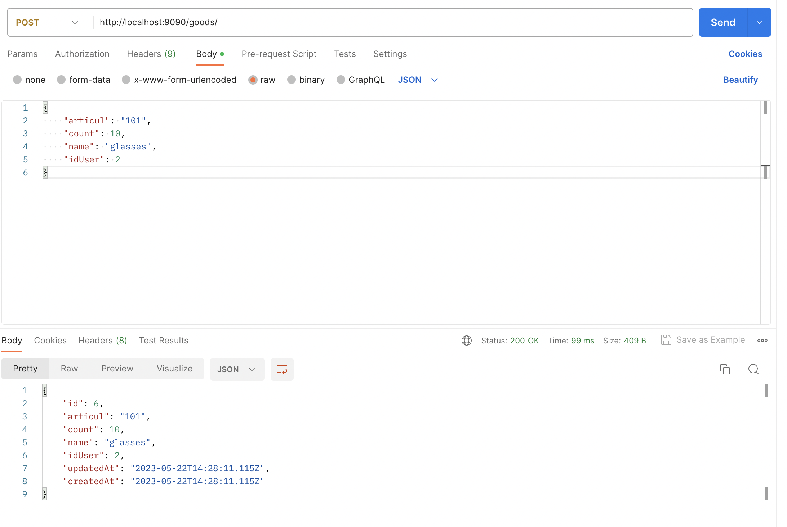
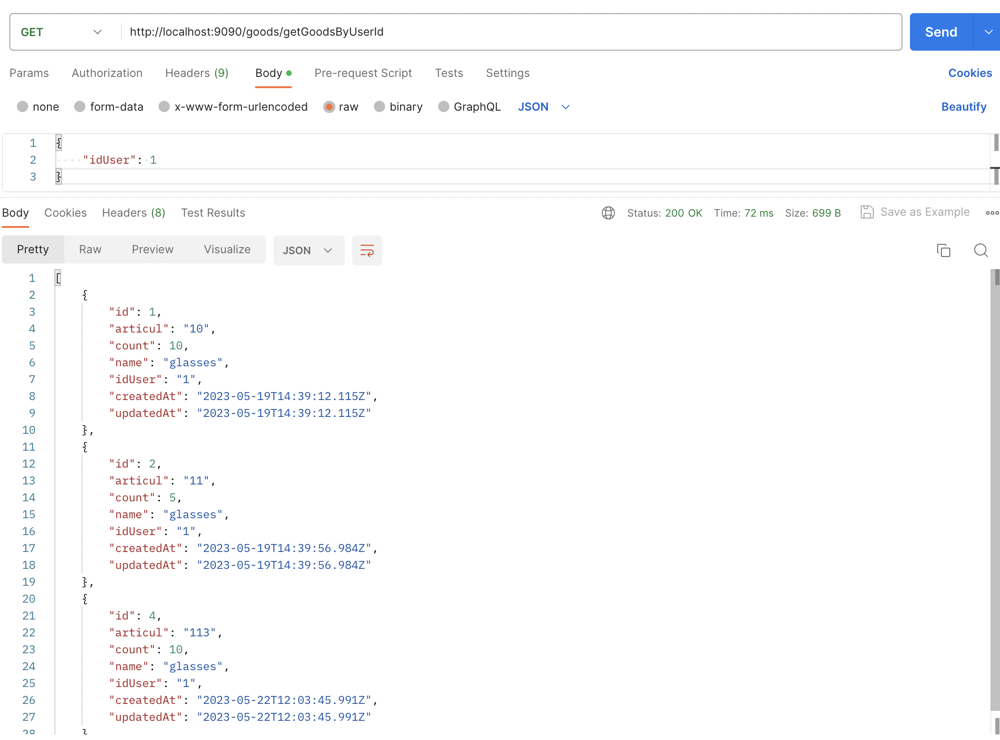

# Лабораторная работа № 3

`Описание:`

Необходимо реализовать отдельный микросервис, выполняющий какую-либо содержательную функцию из всего арсенала функций вашего приложения.

<hr>

# Ход работы

В данной работе сделан отдельный микросервис по работе с товарами магазина. 
Через gateway можно сделать CRUD операции, для мнимой связи двух баз данных используется id того пользователя, 
который взаимодействует с системой. Данный id передается в теле запроса.

<hr>

# Структура проекта

```bash
.
├── gateway
│   ├── Makefile
│   ├── index.js
│   ├── node_modules
│   ├── package-lock.json
│   └── package.json
├── main app
│   ├── Makefile
│   ├── db.sqlite
│   ├── node_modules
│   ├── nodemon.json
│   ├── package-lock.json
│   ├── package.json
│   ├── src
│   └── tsconfig.json
└── microservice
    ├── Makefile
    ├── db.sqlite
    ├── node_modules
    ├── nodemon.json
    ├── package-lock.json
    ├── package.json
    ├── src
    └── tsconfig.json
```

<hr>

# Microservice

` Route `
```js
import express from "express";
import GoodsController from "../../../controllers/goods/Goods";

const router: express.Router = express.Router();
const controller: GoodsController = new GoodsController();

router.route('/').post(controller.create);
router.route('/countGoods').get(controller.getCountGoods);
router.route('/getGoodsByUserId').get(controller.getGoodsByUserId);

router.route('/:id')
    .get(controller.get)
    .patch(controller.update)
    .delete(controller.delete);

export default router;
```

` controllers `

```js
import GoodsService from '../../services/goods/Goods'

class GoodsController {
    private goodsService: GoodsService

    constructor() {
        this.goodsService = new GoodsService()
    }

    get = async (request: any, response: any) => {
        try {
            const goods = await this.goodsService.getById(
                Number(request.params.id)
            )

            response.send(goods)
        } catch (error: any) {
            response.status(404).send({ "error": "error" })
        }
    }

    create = async (request: any, response: any) => {
        const { body } = request

        try {
            const goods = await this.goodsService.create(body)

            response.status(200).send(goods)
        } catch (error: any) {
            response.status(400).send({ "error": "error" })
        }
    }

    update = async (request: any, response: any) => {

        const { body } = request

        const id = Number(request.params.id)

        try {
            const goods = await this.goodsService.update(id, body)

            response.send(goods)
        } catch (error: any) {
            response.status(400).send({ "error": "error" })
        }
    }

    delete = async (request: any, response: any) => {
        const id = Number(request.params.id)

        try {
            await this.goodsService.delete(id)

            response.status(200).send({ message: `Goods with id ${id} has been deleted` })
        } catch (error: any) {
            response.status(400).send({ "error": "error" })
        }
    }

    getCountGoods = async (request: any, response: any) => {
        try {
            const goods = await this.goodsService.getCountGoods()
            response.send(goods)
        } catch (error: any) {
            response.status(404).send({ "error": "error" })
        }
    }

    getGoodsByUserId = async (request: any, response: any) => {
        try {
          const { idUser } = request.body;
          const goods = await this.goodsService.find(Number(idUser));
          response.send(goods);
        } catch (error: any) {
          response.status(404).send({ error: "error" });
        }
      }      
           
}

export default GoodsController
```

<hr>

# Gateway

`index.js`

```js
const express = require('express');
const axios = require('axios');

const app = express();
const port = 3000;

app.use(express.json());

app.all('/goods/*', async (req, res) => {
  const url = `http://localhost:9091${req.originalUrl}`;
  
  try {
    const response = await axios({
      method: req.method,
      url,
      data: req.body,
    });
    res.status(response.status).send(response.data);
  } catch (error) {
    if (error.response) {
      res.status(error.response.status).send(error.response.data);
    } else {
      res.status(500).send('Internal Server Error');
    }
  }
});

app.listen(port, () => {
  console.log(`Gateway listening at http://localhost:${port}`);
});
```

<hr>

# Main app

` route `

```js
import express from "express"
import GoodsController from "../../../controllers/goods/Goods"

const router: express.Router = express.Router()

const controller: GoodsController = new GoodsController()

router.route('/*').all(controller.redirect)

export default router
```

` controllers `

```js
import axios from 'axios';

class GoodsController {
  redirect = async (request: any, response: any) => {
    try {
      const redirectedResponse = await axios.request({
        method: request.method,
        url: `http://localhost:9091${request.originalUrl}`,
        data: request.body,
      });

      response.send(redirectedResponse.data);
    } catch (error: any) {
      response.status(404).send({ error: `error` });
    }
  };
}

export default GoodsController;

```

<hr>

# Пример работы
Создадим товар



Получаем все товары, которые создал администратор сайта



# Вывод

В ходе данной работы был разработан микросервис для взаимодействия с товаром